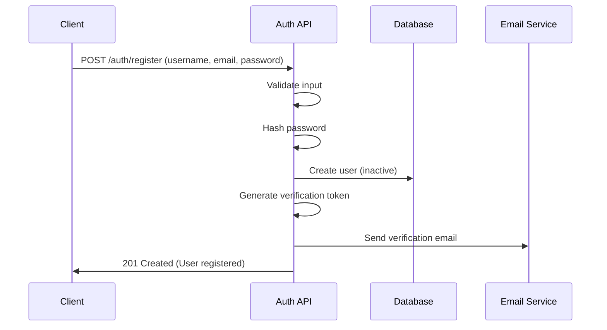
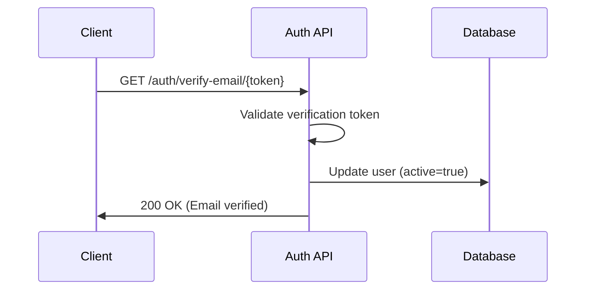
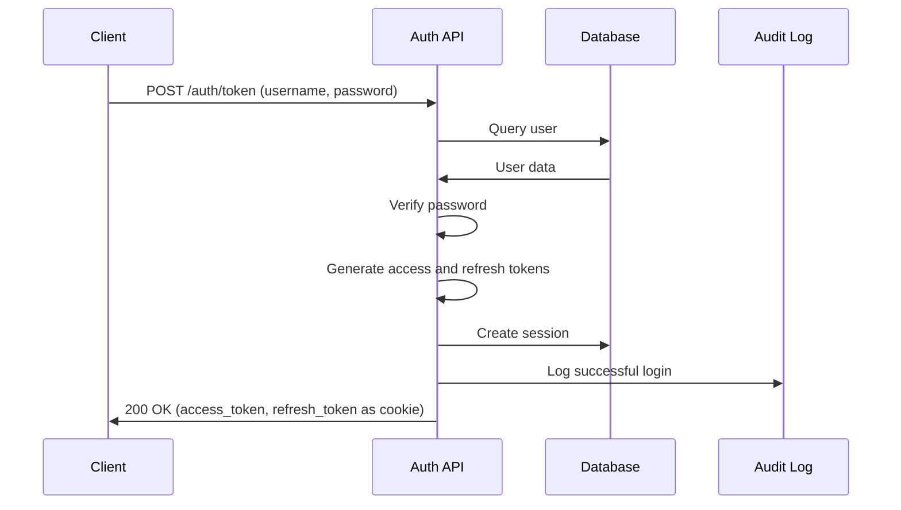
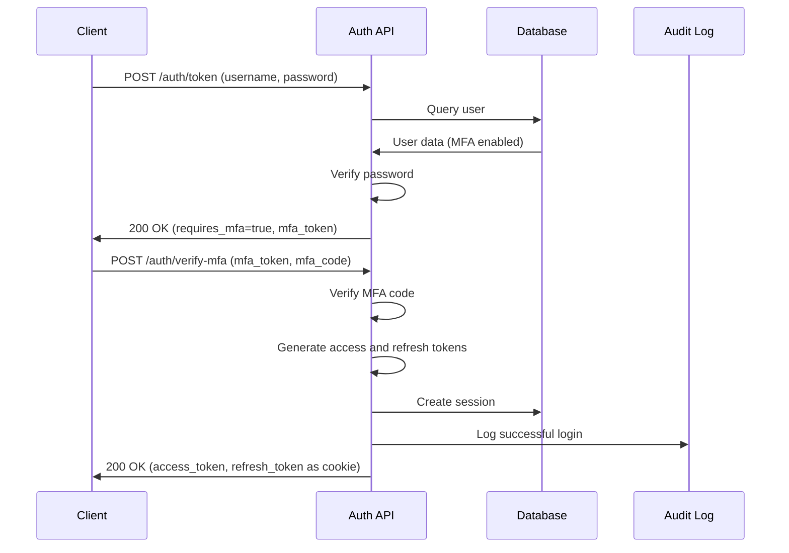
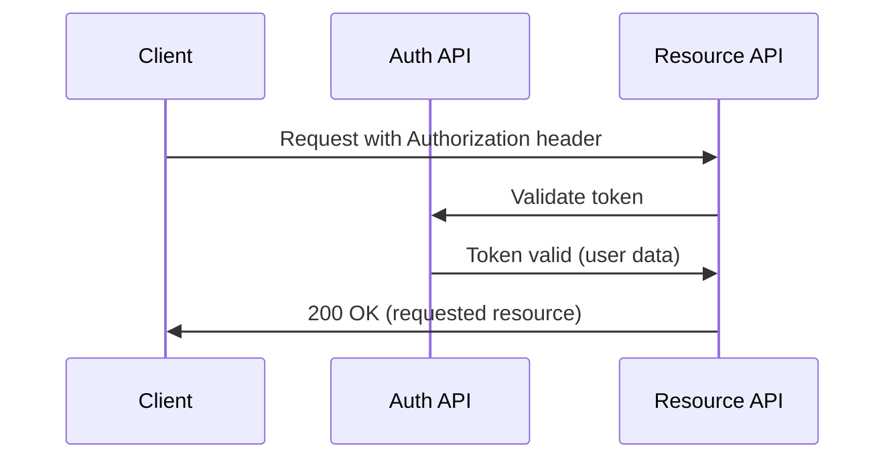
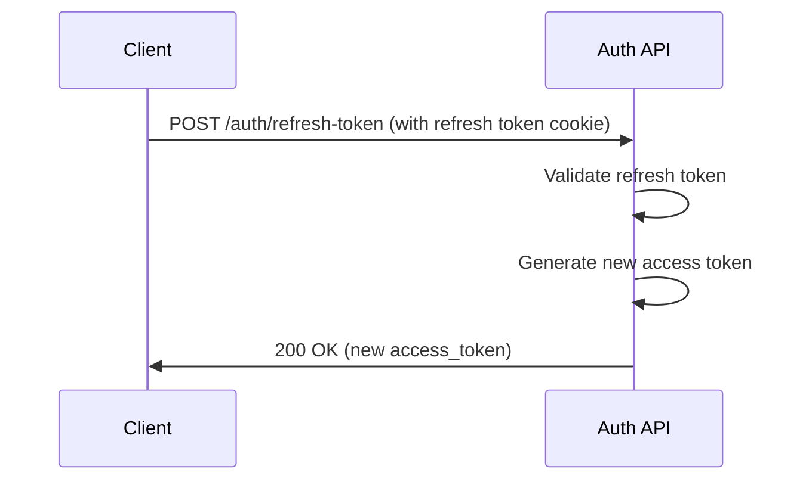
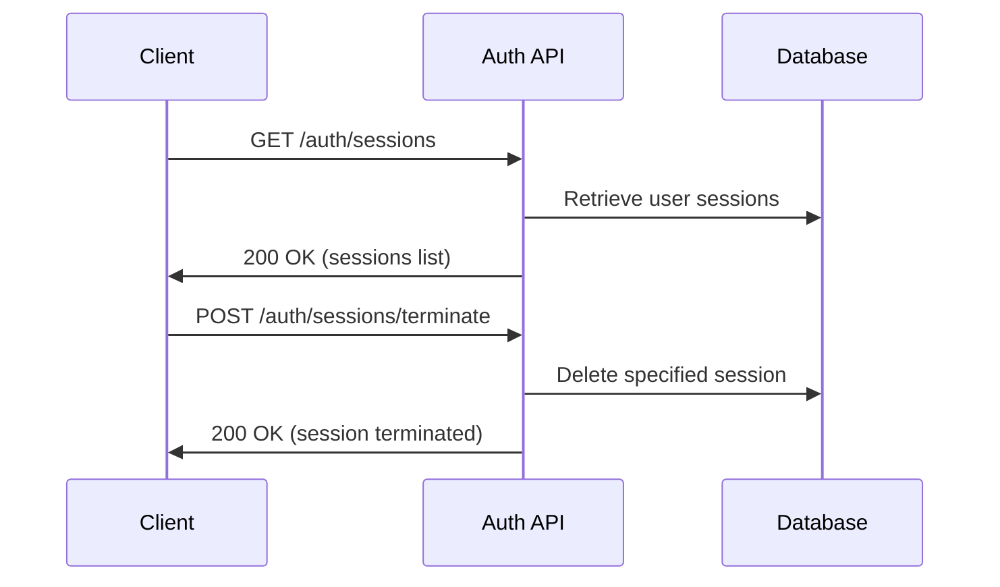
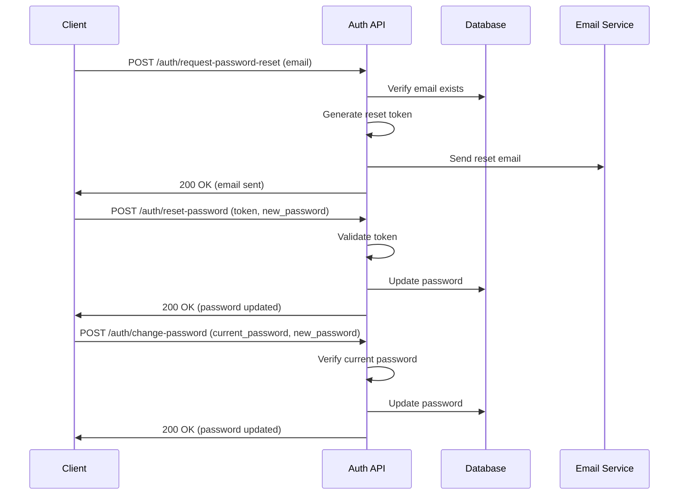
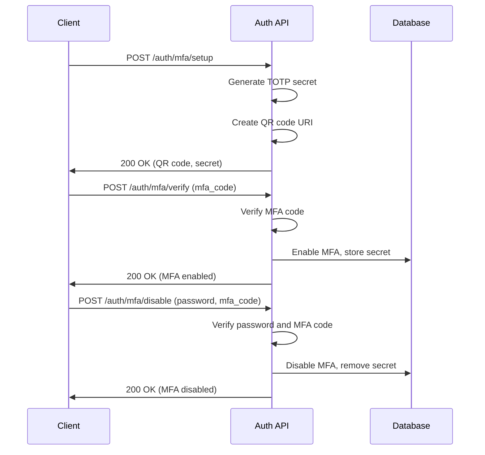
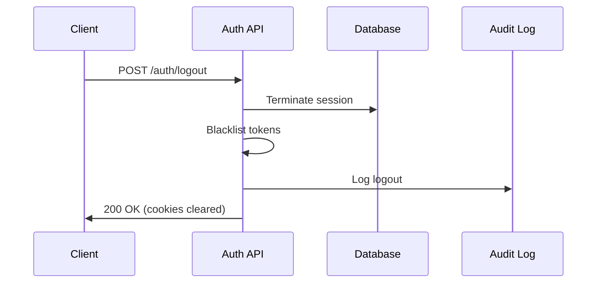

# Authentication Workflow - ISP Management Platform

This document defines the authentication workflow for the ISP Management Platform, detailing the steps and processes involved in user authentication, session management, and security features.

## 1. User Registration and Account Creation

- User submits registration with username, email, password, and profile information
- System validates input data (username uniqueness, email format, password strength)
- Password is hashed using secure algorithm
- User account is created in an "inactive" state
- Verification email is sent to user's email address
- API responds with success message

## 2. Email Verification

- User clicks verification link in email
- System validates the verification token
- If valid, user account is updated to "active" status
- User is redirected to login page with success message

## 3. User Login (Standard Flow)

- User submits username/email and password
- System validates credentials against database
- If valid, system generates:
  - JWT access token (short-lived, typically 30 minutes)
  - JWT refresh token (longer-lived, typically 7 days)
- Refresh token is stored as HTTP-only cookie
- Session information is recorded (IP address, user agent)
- Access token is returned to client for subsequent API calls

## 4. User Login (With MFA)

- User submits username/email and password
- System validates credentials
- If MFA is enabled for user, system requires additional verification
- User is prompted to enter MFA code from authenticator app
- User submits MFA code
- System validates MFA code
- If valid, system generates tokens as in standard flow
- Optional: "Remember this device" feature to skip MFA for trusted devices

## 5. Token-based Authentication

- Client includes access token in Authorization header for API requests
- System validates token on each request:
  - Token format and signature
  - Token expiration
  - Token not blacklisted
- If token is valid, request is processed
- If token is expired, client must use refresh token to get new access token

## 6. Token Refresh

- When access token expires, client requests new token using refresh token
- System validates refresh token
- If valid, system issues new access token
- Refresh token remains valid (sliding expiration optional)
- If refresh token is invalid or expired, user must log in again

## 7. Session Management

- System tracks user sessions with device info and timestamps
- User can view all active sessions
- User can terminate individual sessions or all sessions except current
- Sessions are automatically expired after inactivity period

## 8. Password Management

- User can change password (requires current password verification)
- User can request password reset via email
- System sends email with password reset link
- Password reset token has short expiration (typically 15-60 minutes)
- Password reset requires valid token from email

## 9. Multi-Factor Authentication (MFA)

- User can enable MFA using authenticator app
- MFA setup process:
  1. System generates TOTP secret
  2. System creates QR code for authenticator app
  3. User scans QR code with app
  4. User verifies setup by entering code from app
  5. System stores MFA secret securely
- User can disable MFA (requires password and MFA code verification)

## 10. Logout

- User requests logout
- System invalidates current session
- System blacklists current access and refresh tokens
- Refresh token cookie is cleared
- User is redirected to login page

## Security Considerations

- All authentication traffic uses HTTPS
- Passwords are hashed using bcrypt or Argon2
- Rate limiting is applied to sensitive endpoints
- JWT tokens have appropriate expiration times
- HTTP-only cookies are used for refresh tokens
- CSRF protection is implemented for cookie-based auth
- Audit logging captures authentication events
- Account lockout occurs after multiple failed attempts
